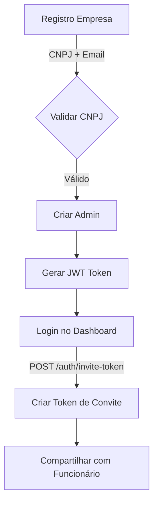
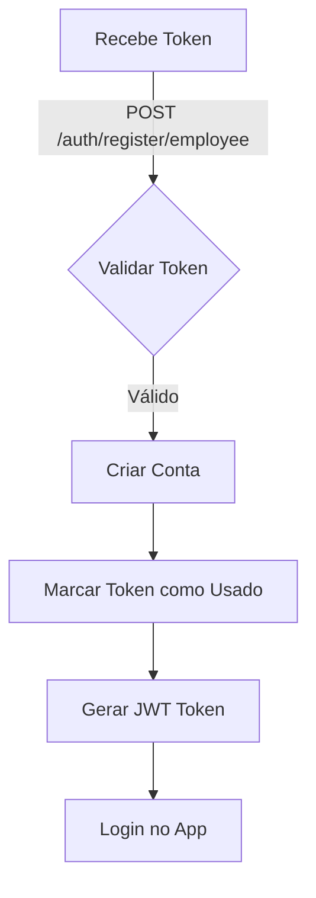

# 🔐 Sistema de Autenticação - Transita.IA

> Sistema completo de autenticação, validação e gerenciamento de tokens para o Transita.IA

## ✨ Funcionalidades

### Autenticação
- ✅ Login de Empresa e Funcionário
- ✅ Registro de Empresa com validação CNPJ
- ✅ Registro de Funcionário com token de convite
- ✅ Geração e gerenciamento de JWT tokens
- ✅ Alteração de senha com validação
- ✅ Recuperação de perfil autenticado

### Validações em Tempo Real
- ✅ **CNPJ**: Validação via BrasilAPI (Receita Federal)
- ✅ **CEP**: Validação e auto-preenchimento via BrasilAPI
- ✅ **Email**: Validação de formato e duplicidade
- ✅ **Senha**: Verificação de força (fraca/média/forte)
- ✅ **Token**: Validação e verificação de uso único

### Gestão de Tokens
- ✅ Geração de tokens de convite por admin
- ✅ Tokens com data de expiração configurável
- ✅ Uso único e permanente de tokens
- ✅ Listagem de tokens gerados
- ✅ Desativação de tokens

### Segurança
- ✅ Hash de senhas com bcrypt
- ✅ JWT com expiração de 24h
- ✅ Validação em backend e frontend
- ✅ CORS configurado
- ✅ Interceptors para token refresh

---

## 🏗️ Arquitetura

### Backend
```
backend/
├── src/
│   ├── authService.js          # Lógica principal de autenticação
│   ├── authRoutes.js            # Endpoints da API
│   ├── validationService.js     # Validações (CNPJ, CEP, email, senha)
│   ├── inviteTokenService.js    # Gerenciamento de tokens de convite
├── userService.js               # Banco de dados em memória
├── server.js                    # Servidor Express
└── package.json
```

### Frontend
```
src/
├── components/Auth/
│   ├── Login.jsx                # Componente de autenticação completo
│   └── Login.css                # Estilos com animações
├── hooks/
│   ├── useAuth.js               # Hook para operações de auth
│   └── useValidation.js         # Hook para validações
├── services/
│   └── api.js                   # Cliente HTTP configurado
└── ...
```

---

## 🚀 Início Rápido

### 1. Backend
```bash
cd backend
npm install
npm run dev
```

O backend estará em: `http://localhost:3002/api`

### 2. Frontend
```bash
npm install
npm run dev
```

O frontend estará em: `http://localhost:5173`

### 3. Testar no Navegador
```
http://localhost:5173/login
```

---

## 📋 Fluxo de Autenticação

### Empresa


### Funcionário


---

## 📚 API Endpoints

### Públicos
| Método | Endpoint | Descrição |
|--------|----------|-----------|
| POST | `/auth/login` | Login para empresa/funcionário |
| POST | `/auth/register/company` | Registrar nova empresa |
| POST | `/auth/register/employee` | Registrar funcionário com token |
| GET | `/auth/validate-email/:email` | Validar formato de email |
| POST | `/auth/validate-cnpj` | Validar CNPJ (BrasilAPI) |
| POST | `/auth/validate-cep` | Validar CEP (BrasilAPI) |
| POST | `/auth/validate-password` | Validar força de senha |

### Autenticados
| Método | Endpoint | Descrição |
|--------|----------|-----------|
| GET | `/auth/profile` | Obter perfil do usuário |
| PUT | `/auth/profile` | Atualizar perfil |
| PUT | `/auth/change-password` | Alterar senha |
| POST | `/auth/invite-token` | Gerar token (admin only) |
| GET | `/auth/invite-tokens` | Listar tokens (admin only) |

> Detalhes completos em [API_DOCUMENTATION.md](./API_DOCUMENTATION.md)

---

## 🎯 Validações Implementadas

### Registro de Empresa
```javascript
✅ Email não duplicado
✅ Senha com 8+ caracteres, maiúsculas, minúsculas, números
✅ CNPJ válido na Receita Federal
✅ Empresa com 6+ meses de existência
✅ CEP válido (opcional, auto-preenche endereço)
```

### Registro de Funcionário
```javascript
✅ Email não duplicado
✅ Senha atende critérios de força
✅ Token de convite válido
✅ Token não utilizado anteriormente
✅ Token não expirado
✅ Empresa associada existe
```

### Login
```javascript
✅ Email existe
✅ Senha correta
✅ Conta ativa
```

---

## 🔑 Hooks React Disponíveis

### useAuth()
```javascript
const {
  user,
  token,
  loading,
  error,
  isAuthenticated,
  login,
  registerCompany,
  registerEmployee,
  logout,
  getProfile,
  updateProfile,
  changePassword,
  generateInviteToken,
  listInviteTokens
} = useAuth();
```

### useValidation()
```javascript
const {
  validations,
  loading,
  errors,
  validateEmail,
  validateCNPJ,
  validateCEP,
  validatePassword,
  clearValidations,
  resetValidation
} = useValidation();
```

---

## 💾 Armazenamento

### Frontend
```javascript
// Token salvo em localStorage
localStorage.getItem('token')

// Usuário salvo em localStorage
localStorage.getItem('user')
```

### Backend
```javascript
// Estrutura em memória (produção: usar banco real)
let users = [{...}]
let companies = [{...}]
let employees = [{...}]
let companyAdmins = [{...}]
```

---

## 🔐 Boas Práticas de Segurança

1. **Nunca compartilhe tokens via email**
   - Use HTTPS em produção
   - Tokens salvos em localStorage (não cookies)

2. **Senhas fortes**
   - Mínimo 8 caracteres
   - Incluir maiúsculas, minúsculas, números e símbolos

3. **CNPJ validado**
   - Apenas CNPJ válido na Receita Federal
   - Empresas com 6+ meses

4. **Tokens de convite**
   - Expiram automaticamente
   - Uso único
   - Vinculados à empresa

5. **JWT com expiração**
   - 24h de validade por padrão
   - Implementar refresh tokens em produção

---

## 📝 Exemplos de Uso

### Login Empresa
```javascript
const { login } = useAuth();

const handleLogin = async () => {
  const result = await login('admin@empresa.com', 'SenhaForte123!');
  if (result.success) {
    navigate('/dashboard');
  }
};
```

### Registrar Empresa
```javascript
const { registerCompany } = useAuth();

const handleRegister = async () => {
  const result = await registerCompany({
    name: 'Minha Empresa',
    email: 'admin@empresa.com',
    password: 'SenhaForte123!',
    cnpj: '12.345.678/0001-90'
  });
  if (result.success) {
    navigate('/dashboard');
  }
};
```

### Registrar Funcionário
```javascript
const { registerEmployee } = useAuth();

const handleRegister = async () => {
  const result = await registerEmployee({
    name: 'João Silva',
    email: 'joao@empresa.com',
    password: 'SenhaForte123!',
    inviteToken: 'token-uuid-aqui'
  });
  if (result.success) {
    navigate('/colaborador');
  }
};
```

### Gerar Token de Convite
```javascript
const { generateInviteToken } = useAuth();

const handleGenerateToken = async () => {
  const result = await generateInviteToken(30); // 30 dias
  if (result.success) {
    console.log('Token:', result.token.token);
  }
};
```

### Validar CNPJ em Tempo Real
```javascript
const { validateCNPJ } = useValidation();

const handleCNPJChange = async (cnpj) => {
  const data = await validateCNPJ(cnpj);
  if (data) {
    console.log('Empresa:', data.name);
  }
};
```

---

## 🚨 Tratamento de Erros

### Frontend
```javascript
if (!result.success) {
  // result.error contém mensagem de erro
  showError(result.error);
}

// Ou via hook
const { error: authError } = useAuth();
if (authError) {
  showError(authError);
}
```

### Backend
```javascript
{
  "error": "Email já cadastrado",
  "code": "COMPANY_REGISTRATION_FAILED"
}
```

---

## 📊 Estrutura de Dados

### User
```javascript
{
  id: "user_uuid",
  email: "user@empresa.com",
  password: "bcrypt_hash",
  role: "COMPANY" | "EMPLOYEE",
  companyId: "comp_uuid",
  employeeId: "emp_uuid" | null,
  isActive: true,
  createdAt: "2024-01-08T...",
  updatedAt: "2024-01-08T..."
}
```

### Company
```javascript
{
  id: "comp_uuid",
  name: "Empresa ABC",
  cnpj: "12.345.678/0001-90",
  email: "admin@empresa.com",
  phone: "11987654321",
  city: "São Paulo",
  state: "SP",
  status: "ACTIVE",
  plan: "BASIC",
  createdAt: "2024-01-08T...",
  updatedAt: "2024-01-08T..."
}
```

### InviteToken
```javascript
{
  id: "token_uuid",
  token: "550e8400-e29b-41d4-a716-446655440000",
  companyId: "comp_uuid",
  generatedBy: "user_uuid",
  createdAt: "2024-01-08T...",
  expiresAt: "2024-02-08T...",
  usedAt: "2024-01-10T...",
  usedBy: { userId: "emp_user", email: "emp@empresa.com" },
  isActive: true
}
```

---

## 🔄 Fluxo de Componente Login

```
Login.jsx
├── useState: mode (login/register)
├── useState: userType (company/employee)
├── useState: formData
├── useAuth(): hook de autenticação
├── useValidation(): hook de validações
├── handleSubmit()
│   ├── Login → authService.login()
│   ├── Register Company → validações + registerCompany()
│   └── Register Employee → validateToken() + registerEmployee()
└── Renderizar formulário com:
    ├── Seletor de tipo (empresa/funcionário)
    ├── Campos dinâmicos por tipo
    ├── Validação em tempo real
    ├── Mensagens de erro/sucesso
    └── Animações com Framer Motion
```

---

## 📦 Dependências Principais

### Backend
- **express**: Framework web
- **bcryptjs**: Hash de senhas
- **jsonwebtoken**: JWT tokens
- **firebase-admin**: Firebase Admin SDK
- **axios**: Cliente HTTP para BrasilAPI
- **uuid**: Geração de IDs únicos
- **dotenv**: Variáveis de ambiente

### Frontend
- **react**: UI framework
- **react-router-dom**: Roteamento
- **axios**: Cliente HTTP
- **framer-motion**: Animações
- **react-icons**: Ícones

---

## 🧪 Testes

### Testar com cURL
```bash
# Login
curl -X POST http://localhost:3002/api/auth/login \
  -H "Content-Type: application/json" \
  -d '{"email":"user@example.com","password":"pass123"}'

# Registrar Empresa
curl -X POST http://localhost:3002/api/auth/register/company \
  -H "Content-Type: application/json" \
  -d '{
    "name":"Empresa",
    "email":"admin@emp.com",
    "password":"Pass123!",
    "cnpj":"11.222.333/0001-81"
  }'

# Validar CNPJ
curl -X POST http://localhost:3002/api/auth/validate-cnpj \
  -H "Content-Type: application/json" \
  -d '{"cnpj":"11.222.333/0001-81"}'
```

---

## 📚 Documentação Completa

- [API_DOCUMENTATION.md](./API_DOCUMENTATION.md) - Endpoints e exemplos
- [SETUP_AUTHENTICATION.md](./SETUP_AUTHENTICATION.md) - Instalação e configuração

---

## ⚡ Performance

- Validações assíncronas em tempo real
- Debounce em validação de campos
- Tokens JWT sem sessão no servidor
- Lazy loading de validações

---

## 🐛 Debug

### Habilitar logs
```javascript
// Backend
NODE_ENV=development npm run dev

// Frontend
localStorage.setItem('DEBUG', 'true')
```

### Inspecionar token
```javascript
const token = localStorage.getItem('token');
console.log(JSON.stringify(token.split('.')[1]));
```

---

## 📄 Licença

MIT

---

## 👤 Suporte

Para dúvidas ou problemas:
1. Verificar [API_DOCUMENTATION.md](./API_DOCUMENTATION.md)
2. Verificar [SETUP_AUTHENTICATION.md](./SETUP_AUTHENTICATION.md)
3. Abrir issue no repositório

---

**Última atualização:** 8 de janeiro de 2026  
**Versão:** 1.0.0

Desenvolvido com ❤️ para Transita.IA
